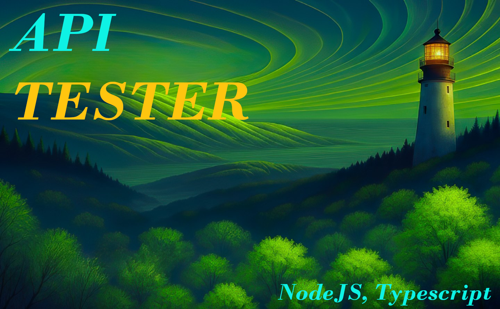

# API Load Tester




A high-performance, lightweight API load testing tool built with **Node.js** and **TypeScript**. Stress-test GET and POST endpoints with configurable RPS and duration, featuring detailed logging and recursive data generation.

---

## 🚀 Key Features

- **Asynchronous Execution**: Leverages Node.js event loop and `axios` for efficient concurrent request handling.
- **Configurable Load**: Easily set `requestsPerSecond` and `durationInSeconds` for tailored stress testing.
- **Detailed Logging**: All failed requests and (optionally) successful ones are logged to the `results/` directory with timing and response bodies.
- **Robust Request Tracking**: Ensures accurate reporting of sent vs. completed requests, even under heavy failure rates.
- **Type-Safe Dynamic Data**: Uses a recursive data generator for complex POST request payloads.
- **Modern Stack**: Developed with TypeScript 5+, ESM, and strict linting rules.

## 🛠️ Prerequisites

- **Node.js**: v18.0.0 or higher
- **npm**: v9.0.0 or higher

## 📦 Installation & Setup

1. **Clone the Repository**:

   ```bash
   git clone https://github.com/your-username/api-tester.git
   cd api-tester
   ```

2. **Install Dependencies**:
   Ensure you have Node.js installed, then run:

   ```bash
   npm install
   ```

3. **Configure Environment**:
   Create a `.env` file in the root directory:

   ```env
   BASE_URL=https://api.example.com/endpoint
   TOKEN=your_bearer_token_here
   ```

## 🏃 Usage

You can execute the tests directly using `tsx` (no pre-compilation required):

### GET Test

Used for performance testing read endpoints with optional query parameters.

```bash
npx tsx testGet.ts
```

### POST Test

Used for stress testing write endpoints with dynamic payload generation.

```bash
npx tsx testPost.ts
```

## 📊 Results

Test summaries and failure logs are saved in the `results/` directory:

- `results/results.txt`: Output from GET tests.
- `results/post_results.txt`: Output from POST tests.

## 🏗️ Architecture & Best Practices

### Code Quality

- **TypeScript**: Strict type checking enforced (`noImplicitAny: true`, etc.).
- **ESLint**: Configured with `typescript-eslint` for consistent code quality.
- **Error Handling**: Uses `axios.isAxiosError` type guards for precise error reporting.

### Performance Testing Strategy (QA Best Practices)

1. **RPS Throttling**: Uses `setInterval` with internal loops to maintain a steady request rate.
2. **Graceful Completion**: Uses `finally` blocks to track request completion, ensuring final reports are only generated after all pending requests are settled.
3. **Log Management**: Separates results by test type and prevents log bloat by allowing optional logging of successful responses.

## 🧹 Maintenance

**Type Checking:**

```bash
npx tsc --noEmit
```

**Linting:**

```bash
npx eslint .
```

---
**Senior QA & TypeScript Recommendation:** Always verify your `.env` configuration against a staging environment before running high RPS tests to avoid unintentional API rate limiting or service disruption.
